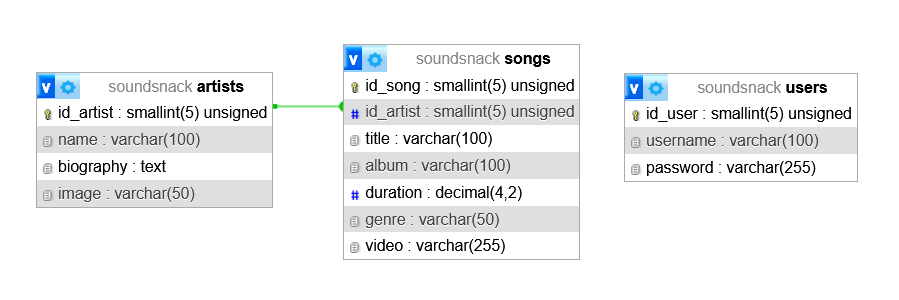

#  Web 2 | Trabajo Práctico Especial

### Grupo 80
Manzalini Abitante, Malena
> manzamale@gmail.com

***
## Listado de Canciones y Artistas
El usuario será capaz de visualizar un conjunto de **canciones** (ítems), cada una perteneciente a un determinado **artista** (categoría). A su vez, los usuarios registrados serán capaces de ingresar nuevos lanzamientos y registrar artistas.

Para desplegar el sitio usamos **XAMPP**, en un servidor con **Apache y MySQL**. El archivo **.sql** en el repositorio se importa en phpMyAdmin, nosotros utilizamos el nombre "soundsnack" como indica el archivo. Para bajar los archivos del repositorio, iniciar git y realizar un git clone para copiar todos los datos a la maquina local.
(* AUTODEPLOY)

Hay que loguear para ingresar a las funcionalidades de administrador (**user:** webadmin, **pass:** admin)

***
### Diagrama Entidad-Relación

***
### TO-DO
- ARREGLAR MENSAJES DE ERROR
- Validar entrada de datos desde controller
- update README